Simulation population-scale Allele Differential Expression from Metagenomic and metranscriptomic data
================
Modelling genomic parameters
----------------------------

The depth of coverage of the genome is modelled by a negative binomial distribution. To learn the NB parameters, I use the sum of the read counts of the reference and alternative alleles generated by DiscoSNP++ ran on metaG of each sample. The allele frequency $freq=\\frac{read\\\_count A}{read\\\_count A + read\\\_count B}$ distribution shows a U shape and is modelled by a Beta distribution. The distribution of the loci expression is a model admixture that cannot be estimated, we approximate the distribution by a gamma distribution.

``` r
library(fitdistrplus)
```

    ## Loading required package: MASS

    ## Loading required package: survival

    ## Loading required package: npsurv

    ## Loading required package: lsei

``` r
# Input: read counts file
# 1. fit the allele frequency by a beta distribution
# 2. fit the depth of coverage by a negative binomial
# 3. fit the loci expression level by a gamma distribution
# Return: the distribution parameters for the three fits
getNBparam <- function(file){
  RC = read.table(file)
  colnames(RC) = c("genome_RC_A", "genome_RC_B",
                   "transcript_RC_A","transcript_RC_B")
  
  # 1. Genome coverage is fitted by a negative binomial distribution
  fit_Gcoverage = fitdist(RC$genome_RC_A + RC$genome_RC_B, 
                          method = "mme", distr="nbinom")
  plot(fit_Gcoverage)
  GenomeCov_NB_theta = fit_Gcoverage$estimate[1]
  GenomeCov_NB_mu = fit_Gcoverage$estimate[2]
  
  # 2. Genome variant frequency distribution is fitted by a beta distribution
  fit_freq = fitdist( RC$genome_RC_A / (RC$genome_RC_A + RC$genome_RC_B), 
                     method = "mme", distr="beta")
  VarFreq_Beta_shape1 = fit_freq$estimate[1]
  VarFreq_Beta_shape2 = fit_freq$estimate[2]
  plot(fit_freq)
  
  # 3. Loci expression level is fitted by a gamma distribituion
  fit_Tcoverage = fitdist(RC$transcript_RC_A + RC$transcript_RC_B, 
                          distr="gamma", method = "mme")
  Expression_Gamma_shape = fit_Tcoverage$estimate[1]
  Expression_Gamma_rate = fit_Tcoverage$estimate[2]
  plot(fit_Tcoverage)
  

  return (as.numeric(as.character(c(GenomeCov_NB_theta, GenomeCov_NB_mu, 
            VarFreq_Beta_shape1, VarFreq_Beta_shape2, 
            Expression_Gamma_shape, Expression_Gamma_rate ))))
}
```

Learning genomic and transcriptomic parameters from real data
-------------------------------------------------------------

The input files format is the following, col 1: RC\_genomic\_allele\_A, col 2: RC\_genomic\_allele\_B, col 3: RC\_transcriptomic\_allele\_A, col 4: RC\_transcriptomic\_allele\_B. We estimate the distribution parameters from seven samples.

``` r
# One read count file per sample
files = list.files ("RC")
files = paste("RC/",files,sep="")
parameters = matrix(unlist(lapply(files,getNBparam)), ncol=6, byrow = TRUE)
```

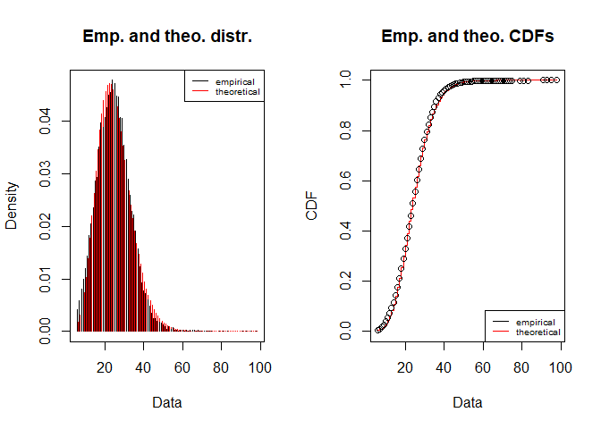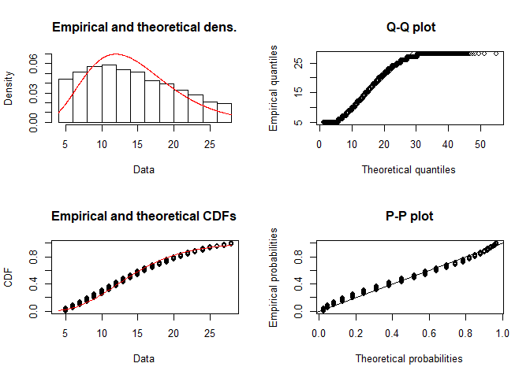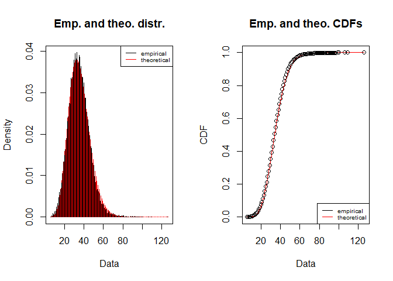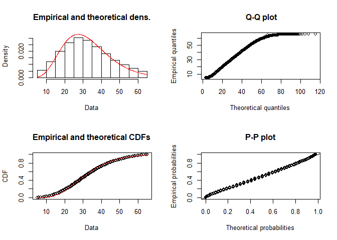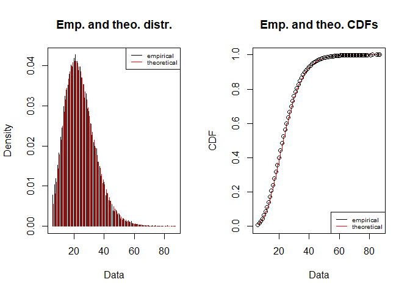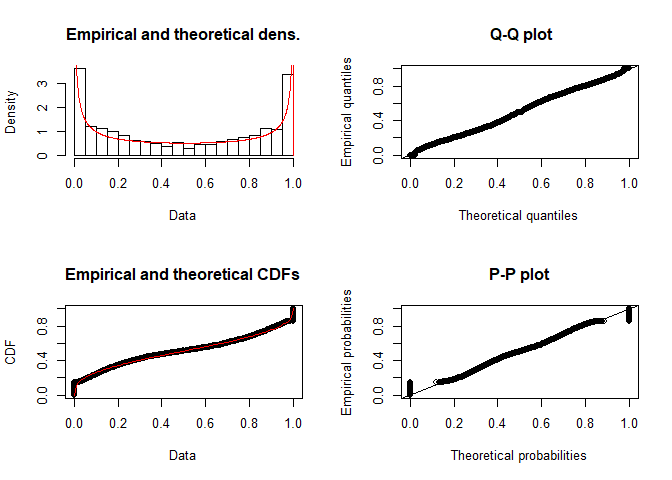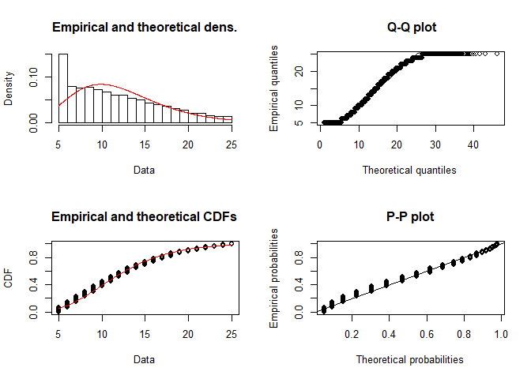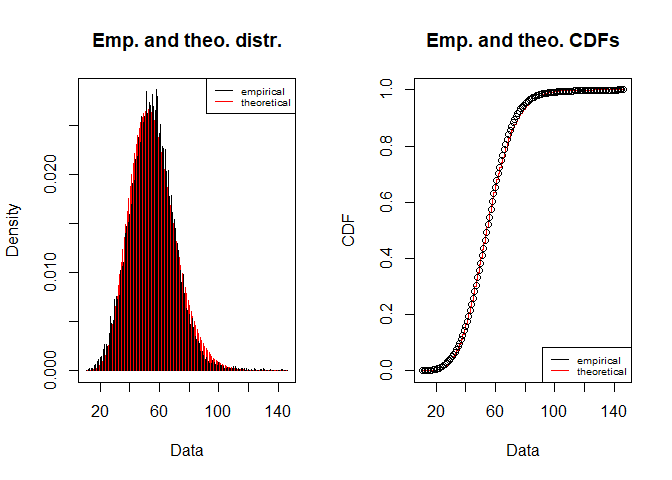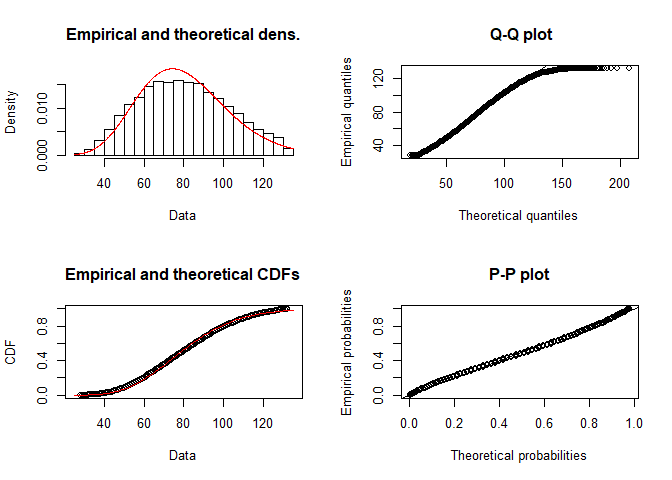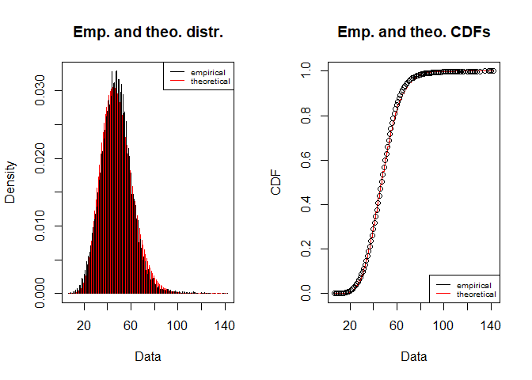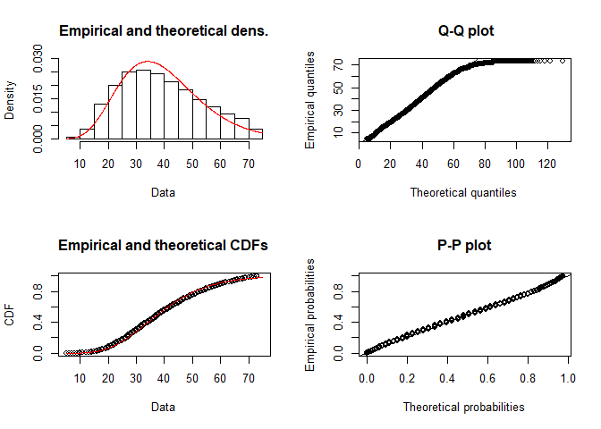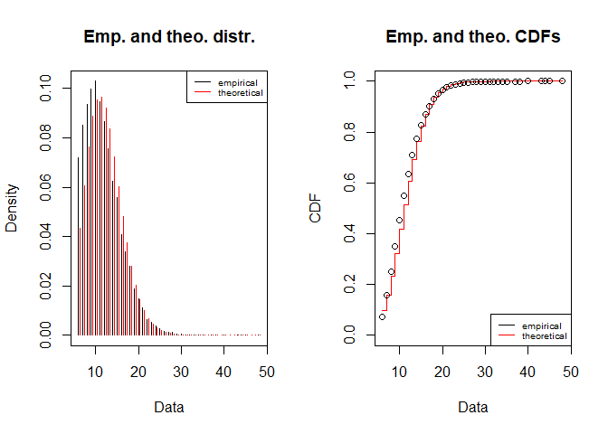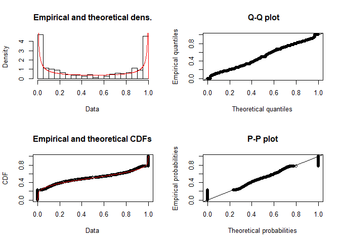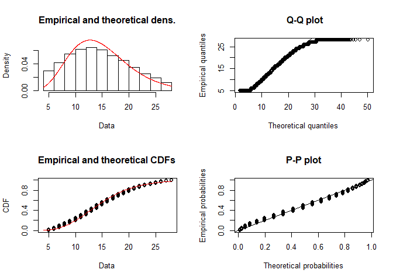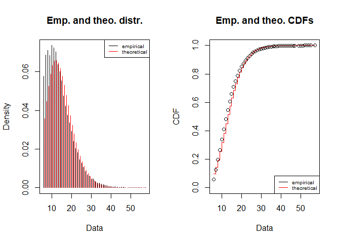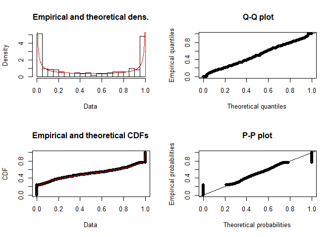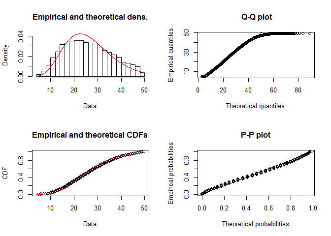

``` r
colnames(parameters) = c("GenomeCov_NB_theta", "GenomeCov_NB_mu", 
                         "VarFreq_Beta_shape1", "VarFreq_Beta_shape2", 
                         "Expression_Gamma_shape", "Expression_Gamma_rate")
rownames(parameters) = c("S155","S158", "S178","S206","S208","S209","S210")
write.table(x = parameters, "genomic_distributions_parameters.txt", sep = "\t", quote = FALSE)
print (parameters)
```

    ##      GenomeCov_NB_theta GenomeCov_NB_mu VarFreq_Beta_shape1 VarFreq_Beta_shape2
    ## S155          11.702165        24.69497           0.3492578           0.3616005
    ## S158          14.975447        35.02305           0.3151723           0.3243779
    ## S178           7.121472        24.21240           0.3595526           0.3731149
    ## S206          17.009232        55.33740           0.3359127           0.3456253
    ## S208          17.494034        47.89654           0.3058504           0.3145081
    ## S209          22.626873        11.68779           0.2448241           0.2519111
    ## S210           7.279214        14.11215           0.2388235           0.2452350
    ##      Expression_Gamma_shape Expression_Gamma_rate
    ## S155               5.540433             0.3793182
    ## S158               6.226704             0.1911681
    ## S178               5.415773             0.4468105
    ## S206              12.799505             0.1587526
    ## S208               7.298620             0.1850488
    ## S209               6.901641             0.4636734
    ## S210               6.873118             0.2603409

Estimation of the Negative Binomial parameter *θ* for any depth of coverage
---------------------------------------------------------------------------

We modelled the relationship between *μ* and *θ* by a linear model such as $\\theta = \\frac{p}{1-p} . \\mu$. With *p* the probabilty of a loci to belong to single-copy region of the genome

``` r
library(ggplot2)
```

    ## Warning: package 'ggplot2' was built under R version 3.5.3

``` r
p = ggplot(data = as.data.frame(parameters), 
           aes( x = GenomeCov_NB_mu, y = GenomeCov_NB_theta))+
  geom_point()+
  geom_smooth(method = lm)+
  xlab(expression(mu))+
  ylab(expression(theta))+
  theme_bw()
print(p)
```

    ## `geom_smooth()` using formula 'y ~ x'

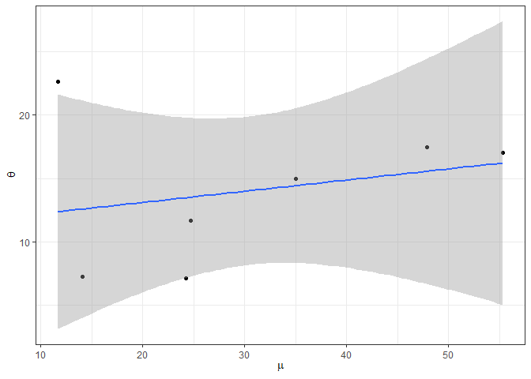

``` r
# Predict the NB theta  with mu by a linear model
fitParam = summary(lm(parameters[,1]~parameters[,2]))
print (fitParam)
```

    ## 
    ## Call:
    ## lm(formula = parameters[, 1] ~ parameters[, 2])
    ## 
    ## Residuals:
    ##    S155    S158    S178    S206    S208    S209    S210 
    ## -1.8219  0.5396 -6.3600  0.7801  1.9218 10.2510 -5.3106 
    ## 
    ## Coefficients:
    ##                 Estimate Std. Error t value Pr(>|t|)  
    ## (Intercept)     11.34407    5.07429   2.236   0.0756 .
    ## parameters[, 2]  0.08828    0.14903   0.592   0.5794  
    ## ---
    ## Signif. codes:  0 '***' 0.001 '**' 0.01 '*' 0.05 '.' 0.1 ' ' 1
    ## 
    ## Residual standard error: 6.027 on 5 degrees of freedom
    ## Multiple R-squared:  0.06557,    Adjusted R-squared:  -0.1213 
    ## F-statistic: 0.3509 on 1 and 5 DF,  p-value: 0.5794

``` r
mu2theta <- function (mu){
  theta = fitParam$coefficients[1] + fitParam$coefficients[2] * mu
  return (theta)
}
```

Estimation of read counts for genome and transcriptome
------------------------------------------------------

The read A count follows a NB distribution of mean = coverage A (random value between 1 and the genome coverage) and size estimated from the data. The read count B follows a NB distribution of mean = coverage B = genome coverage - coverage A and size estimated from the data

``` r
test_RC_Noise <- function (genome_coverage, theta, fbeta1, fbeta2, gamshape, gamrate, transcript_sd){
  # simulate random allele frequency given the beta distrib parameters (shape1 and shape2)
  variant_frequency = rbeta(n = 1, shape1 = fbeta1, shape2 = fbeta2)
  genomic_expect_cov_A = round( variant_frequency * genome_coverage , 0)
  genomic_expect_cov_B = genome_coverage - genomic_expect_cov_A
  
  ## simulate genomic read counts for allele A and B 
  # given expected coverages and the NB distrib parameters
  # first find theta
  thetaA = round(mu2theta(genomic_expect_cov_A))
  thetaB = round(mu2theta(genomic_expect_cov_B))
  # then simulate
  genomic_RC_A = rnbinom (n = 1, size = thetaA, mu = genomic_expect_cov_A) 
  genomic_RC_B = rnbinom (n = 1, size = thetaB, mu = genomic_expect_cov_B)
  # replace NA by 0
  if (is.na(genomic_RC_A)) genomic_RC_A = 0 
  if (is.na(genomic_RC_B)) genomic_RC_B = 0
  
  # simulate allele expression level given the gamma distrib parameters (shape and rate)
  gene_expression_Level = round (rgamma(1, gamshape, gamrate), 0)
  transcriptomic_expect_Cov_A = round(variant_frequency * gene_expression_Level , 0)
  transcriptomic_expect_Cov_B = gene_expression_Level - transcriptomic_expect_Cov_A
  
  # simulate transcriptomic read counts for allele A and B
  # given a poisson distribution
  transcript_RC_A =  rpois(n = 1, transcriptomic_expect_Cov_A )
  transcript_RC_B =  rpois(n = 1, transcriptomic_expect_Cov_B )
  if (transcript_RC_A<0) transcript_RC_A = 0 
  if (transcript_RC_B<0) transcript_RC_B = 0
  
  # Apply Fisher exact test 
  # only if the gene is expressed and the loci is heterozygous
  observed_expression = transcript_RC_A + transcript_RC_B
  if( (observed_expression>0 ) & genomic_RC_A !=0 & genomic_RC_B !=0 ){
    Fisher_pvalue = fisher.test( matrix(c(genomic_RC_A, 
                                genomic_RC_B, 
                                transcript_RC_A, 
                                transcript_RC_B),
                              nrow=2))$p.value
  }
  else{
    Fisher_pvalue = "NA"
  }
  return(as.numeric(as.character(c(Fisher_pvalue, genomic_RC_A , genomic_RC_B, 
                                   transcript_RC_A, transcript_RC_B))))
}
```

Simulation of genomic and transcriptomic read counts
====================================================

I simulate read counts for genomic and transcriptomic for each sample and I apply the FET on each loci and the FDR.

``` r
n_test = 50000
results = c()
# To compare to psADE found in Oithona %ADE for q_value <0.05
oithona = c(0.21, 0.14, 0.33, 1.15, 0.27, 0.03, 0.43)
names(oithona) = rownames(parameters)

for (sample in rownames(parameters)){
  FisherTest = matrix(c(rep(0, 5*n_test)), ncol=5)
                      
  for (j in 1:n_test){
    FisherTest[j,] = test_RC_Noise(round(parameters[sample,"GenomeCov_NB_mu"],0), thetaMu,
                                             parameters[sample,"VarFreq_Beta_shape1"], 
                                             parameters[sample,"VarFreq_Beta_shape2"],
                                             parameters[sample,"Expression_Gamma_shape"],
                                             parameters[sample,"Expression_Gamma_rate"],
                                             parameters[sample,"Expression_variation_sd"]
                                            )
  }
  # Writesimulation output
  dir.create("simulated_data")
  colnames(FisherTest) = c("Fisher_pvalue", "genomic_RC_A" , "genomic_RC_B", 
                                   "transcript_RC_A", "transcript_RC_B")
  write.table(FisherTest, paste("simulated_data/",sample,".txt", sep = ""))
  
  # Check if the genomic read count simulation is OK
  print (sample)
  genome_simulated_coverage = FisherTest[,2] + FisherTest[,3]
  # expected distribution
  theta = parameters[sample,"GenomeCov_NB_theta"]
  mu = parameters[sample,"GenomeCov_NB_mu"]
  genome_expected_coverage = rnbinom (n = n_test, size = theta, mu = mu)
  plot(density(genome_simulated_coverage), col="red", 
       lwd=2, main = paste(sample," expected vs observed coverage distribution"))
  lines (density(genome_expected_coverage), col="blue", lwd = 2, add = TRUE)
  legend(1, 95, legend=c("Simulation", "Real data"),
       col=c("red", "blue"), cex=0.8)
  # remove tests with NA
  FisherTest = as.numeric(as.character(FisherTest[!is.na(FisherTest[,1]),1]))
  hist(FisherTest, breaks=100, freq = F)
  # Apply FDR
  FisherAdj = p.adjust(FisherTest, method = "fdr")
  
  # output metrics
  cutoff = 0.05
  percentage_FET_positives = 100 * length(FisherAdj[FisherAdj<cutoff]) / length(FisherAdj)
  count_FET_positives = length(FisherAdj[FisherAdj<cutoff])
  n_loci_tested = length(FisherAdj)
  
  # Results formatting
  res = c(round(parameters[sample,"GenomeCov_NB_mu"],0), 
          cutoff, 
          percentage_FET_positives,
          n_loci_tested, 
          count_FET_positives,oithona[sample],
          oithona[sample]-percentage_FET_positives,
          100*(oithona[sample]-percentage_FET_positives)/oithona[sample]
          )
  results = rbind(results, res)
}
```

    ## [1] "S155"

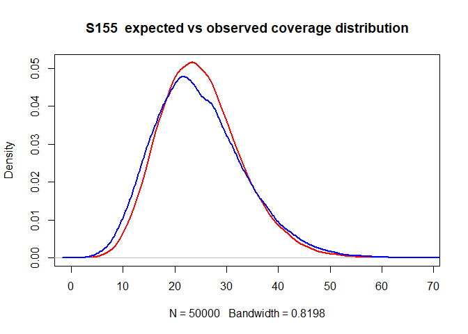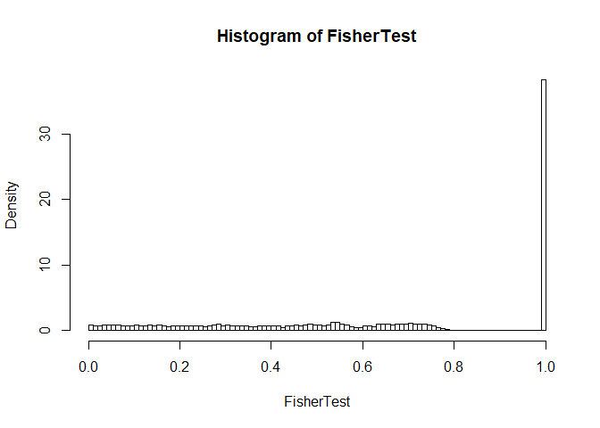

    ## [1] "S158"

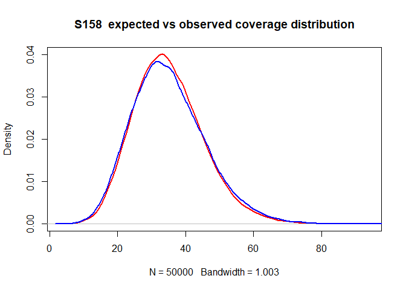

    ## [1] "S178"

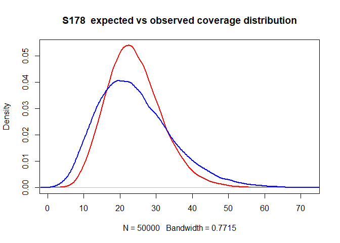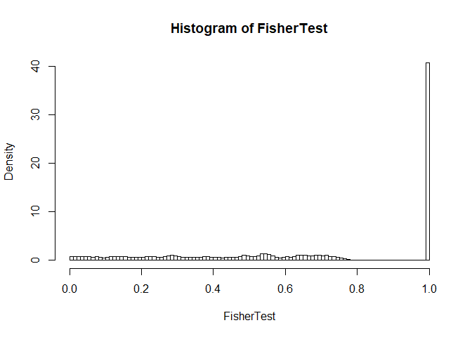

    ## [1] "S206"

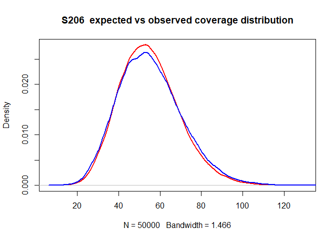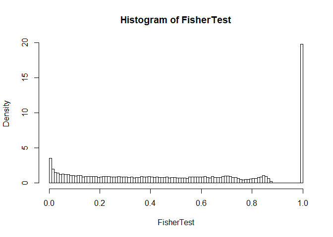

    ## [1] "S208"

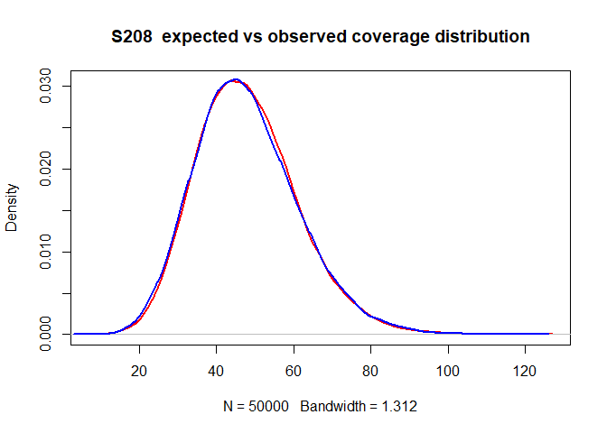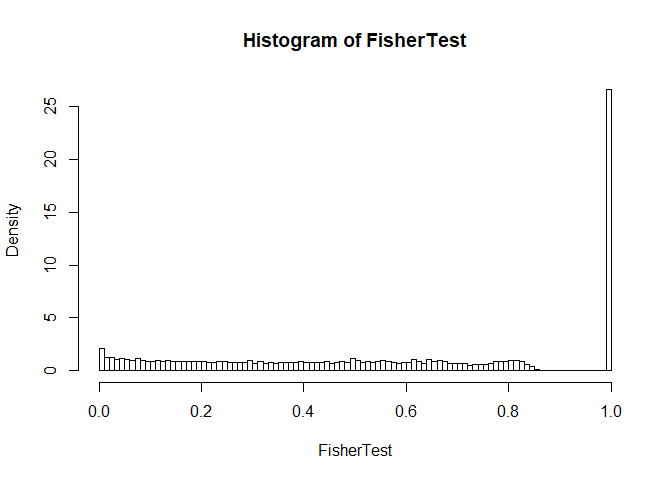

    ## [1] "S209"

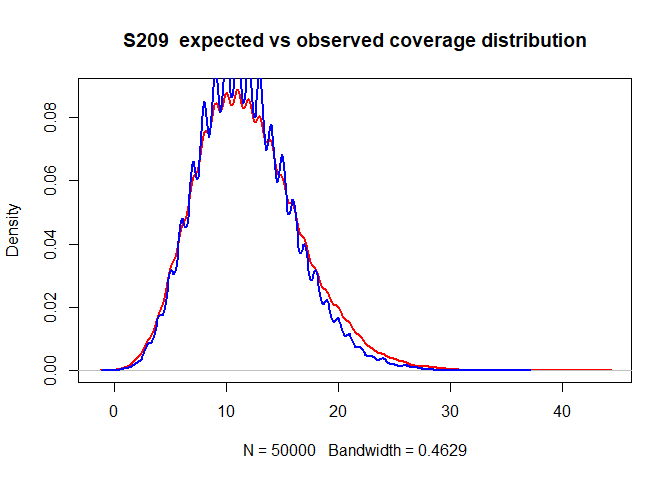

    ## [1] "S210"

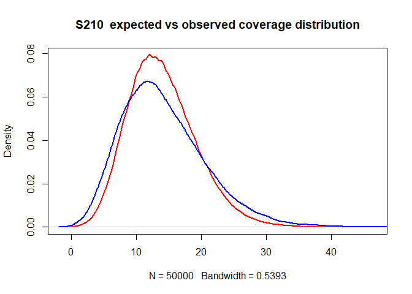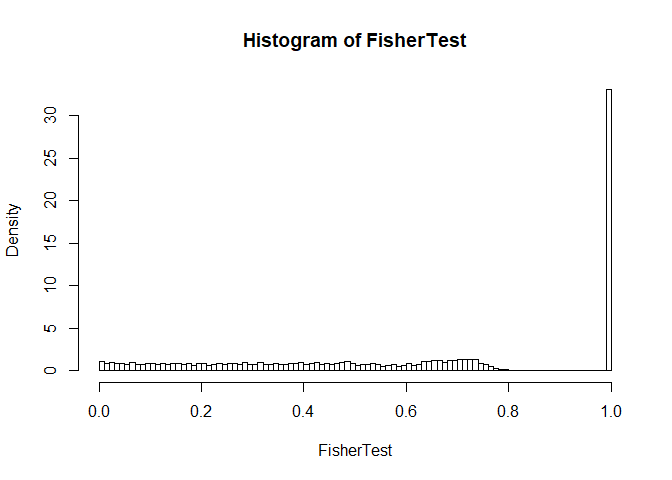

``` r
colnames (results) = c( "Genome coverage", "q-value cutoff", 
                        "%FET positives","Number of tested loci",
                        "counts","%FET real data",
                        "% true psADE in real data", 
                        "% of detected psADE - noise")

rownames(results) = rownames(parameters)
write.table(results,"simulation_FET_results.txt", sep = "\t", quote=FALSE)
knitr::kable (results)
```

|      |  Genome coverage|  q-value cutoff|  %FET positives|  Number of tested loci|  counts|  %FET real data|  % true psADE in real data|  % of detected psADE - noise|
|------|----------------:|---------------:|---------------:|----------------------:|-------:|---------------:|--------------------------:|----------------------------:|
| S155 |               25|            0.05|       0.0031415|                  31832|       1|            0.21|                  0.2068585|                     98.50405|
| S158 |               35|            0.05|       0.0000000|                  32153|       0|            0.14|                  0.1400000|                    100.00000|
| S178 |               24|            0.05|       0.0000000|                  31887|       0|            0.33|                  0.3300000|                    100.00000|
| S206 |               55|            0.05|       0.2524049|                  35657|      90|            1.15|                  0.8975951|                     78.05175|
| S208 |               48|            0.05|       0.0541630|                  33233|      18|            0.27|                  0.2158370|                     79.93962|
| S209 |               12|            0.05|       0.0000000|                  20920|       0|            0.03|                  0.0300000|                    100.00000|
| S210 |               14|            0.05|       0.0000000|                  21788|       0|            0.43|                  0.4300000|                    100.00000|
